# Read It, Don't Watch It: Captioning Bug Recordings Automatically


## Table of Contents
- [Table of Contents](#table-of-contents)
- [Getting Started](#getting-started)
- [Approach](#approach)
    - [Preliminary Study](#preliminary-study)
    - [Phase 1: Action Segmentation](#phase-1-action-segmentation)
    - [Phase 2: Action Attribute Inference](#phase-2-action-attribute-inference)
    - [Phase 3: Description Generation](#phase-3-description-generation)
- [Automated Evaluation](#automated-evaluation)
    - [RQ1: Accuracy of Action Segmentation](#rq1-accuracy-of-action-segmentation)
    - [RQ2: Accuracy of Action Attribute Inference](#rq2-accuracy-of-action-attribute-inference)
- [Usefulness Evaluation](#usefulness-evaluation)
    - [Results](#results)

## Getting Started
<p align="left">
 
</p>

Screen recordings of mobile applications are easy to capture and include a wealth of information, making them a popular mechanism for users to inform developers of the problems encountered in the bug reports.
However, watching the bug recordings and efficiently understanding the semantics of user actions can be time-consuming and tedious for developers.

Inspired by the conception of the video subtitle in movie industry, we present a lightweight approach CAPdroid to caption bug recordings automatically.
CAPdroid is a purely image-based and non-intrusive approach by using image processing and convolutional deep learning models to segment bug recordings, infer user action attributes, and create descriptions as subtitles.

## Approach
<p align="center">
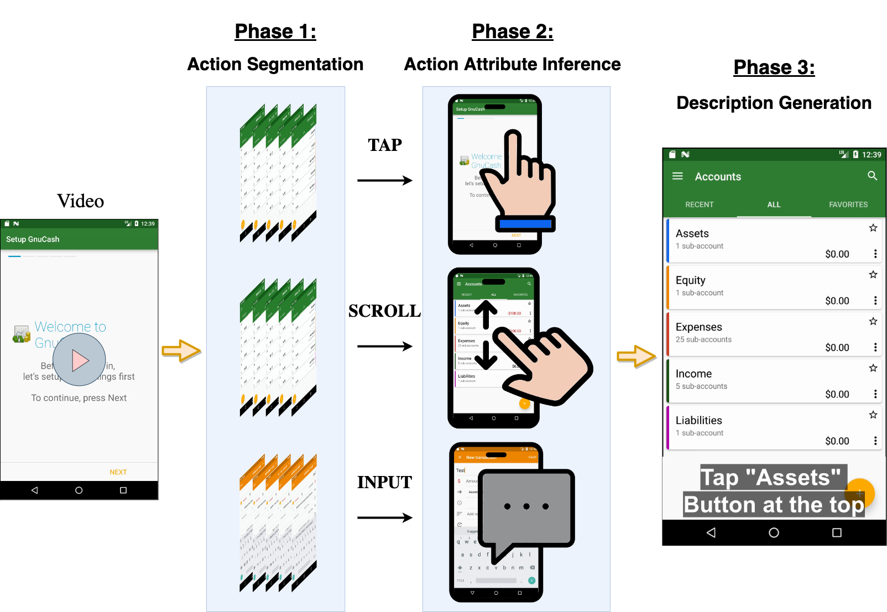 
</p>

Given an input GUI recording, we propose an automated approach to segment the recording into a sequence of clips based on user actions and subsequently localize the action positions to generate natural language descriptions.
Before discussing each phase in detail, we discuss some preliminary understanding of user actions in GUI recording.

> For more details, experimental setup and results, please check the following instructions:
> - Overall approach: [approach.md](approach/)
> - Preliminary Study: [preliminary_study.md](preliminary_study.md)
> - Phase 1: Action Segmentation: [action_segmentation.md](approach/action_segmentation.md)
> - Phase 2: Action Attribute Inference: [action_attribute_inference.md](approach/action_attribute_inference.md)
> - Phase 3: Description Generation: [description_generation.md](approach/description_generation.md)


### Preliminary Study
To understand the recordings from the end-users, we conducted a small pilot study of the GUI recordings from GitHub.
We randomly sampled 1,000 GUI recordings, and we recruited two annotators to manually check the user actions from the recordings.

We observed that 89% of the recordings included a touch indicator, indicating it as a mechanism for the end-user to depict their actions on the screen.
We further classified those touch indicators into three categories, including **default (68%)**, **cursor (27%)**, and **custom (5%)**.

<p align="center">
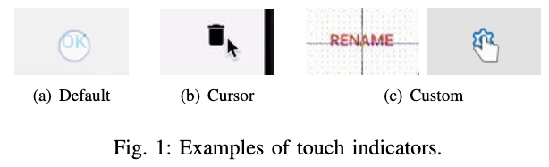 
</p>

<table width="100%"><tbody>
    <th valign="bottom" align="center" width="33%">Default</th>
    <th valign="bottom" align="center" width="33%">Cursor</th>
    <th valign="bottom" align="center" width="33%">Custom</th>
    <tr><td align="center">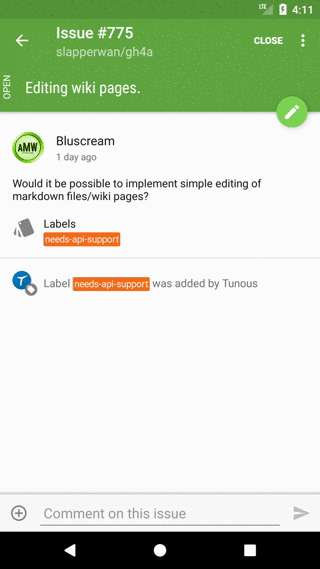</td>
    <td align="center">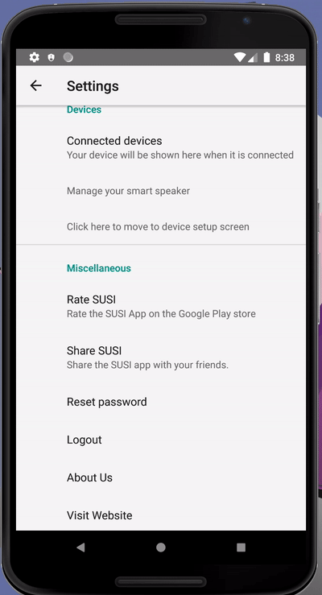</td>
    <td align="center">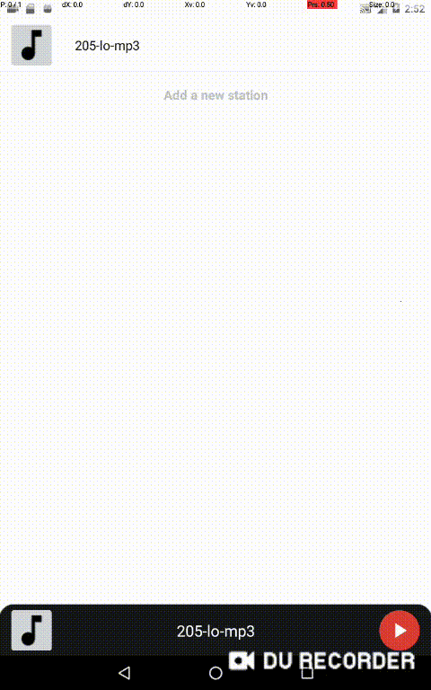</td>
    </tr>
</tbody></table>


### Phase 1: Action Segmentation

<p align="center">
 
</p>
<p align="center">Figure: An illustration of consecutive frame similarity.</p>

A video consists of a sequence of frames to deliver the visual detail of the story for particular scenes.
Different from the recognition of discontinuities in the visual-content flow of natural-scene videos, detecting clips in the GUI recording is to infer scenes of user actions that generally display significant changes in the GUIs.
To that end, we leverage the similarity of consecutive frames to segment user actions (i.e., *TAP*, *SCROLL*, *INPUT*) from GUI recording.


### Phase 2: Action Attribute Inference

<p align="center">
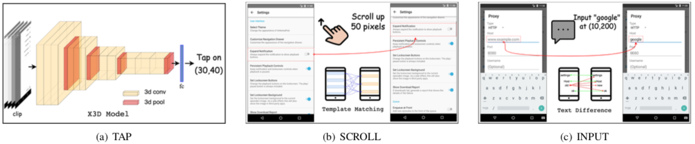 
</p>
<p align="center">Figure: Approaches of Action Attribute Inference.</p>

Given a recording clip of user action segmented by the previous phase, we then infer its detailed attributes, including touch location of (*TAP*), its moving offset (*SCROLL*), and its input text (*INPUT*), to reveal where the user interacts with on the screen.

We propose a deep-learning-based method that models the spatial and temporal features across frames to infer the *TAP* location.
To infer moving offset of *SCROLL*, we adopt an off-the-shelf image-processing method to detect the continuous motion trajectory of GUIs, thus, measuring the user's scrolling direction and distance.
To infer the input text of *INPUT*, we leverage the OCR technique to identify the text difference between the frames of keyboard opening (i.e., where the user starts entering text) and keyboard closing (i.e., where the user ends entering).


### Phase 3: Description Generation
<p align="center">
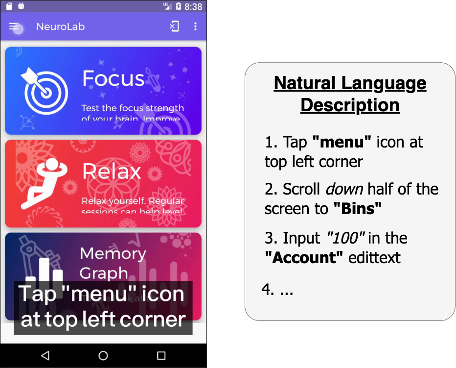 
</p>
<p align="center">Figure: Subtitle and textual steps in the GUI recording.</p>
Once the attributes of the action are derived from the previous phases, we proceed by generating in-depth and easy-to-understand natural language descriptions. To accomplish this, we first leverage mature GUI understanding models to obtain GUI information non-intrusively.
Then, we propose a novel algorithm to phrase actions into descriptions and embed them as subtitles.


## Automated Evaluation
<!-- > For more details, experimental setup and results, please check the instructions in [evaluation.md](evaluation.md) -->

Since our approach consists of two main automated steps to obtain the actions from the recordings, we evaluate these phases accordingly.

- **RQ1:** How accurate is our approach in segmenting action clips from GUI recordings?
- **RQ2:** How accurate is our approach in inferring action attributes from clips?

For **RQ1**, we presented the performance of our approach for [Action Segmentation](#phase-1-action-segmentation) to accurately segment the recordings into *TAP*, *SCROLL*, *INPUT* action clips.
For **RQ2**, we evaluated the ability of our approach for [Action Attribute Inference](#phase-2-action-attribute-inference) to accurately identify the action attributes from clips.

### RQ1: Accuracy of Action Segmentation
<div align="center">
    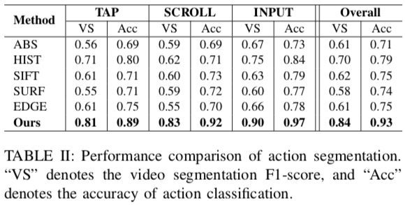 
</div>

The performance of our method is much better than that of other baselines, i.e., 20%, 17% boost in video segmentation F1-score and accuracy compared with the best baseline (HIST).
Although HIST achieves the best performance in the baselines, it does not perform well as it is sensitive to the pixel value.
This is because, the recordings can often have image noise due to fluctuations of color or luminance.
The image similarity metrics based on structural level (i.e., SIFT, SURF) are not sensitive to image pixel, however, they are not robust to compare GUIs.
This is because, unlike images of natural scenes, features in the GUIs may not distinct.
In contrast, our method using SSIM achieves better performance as it takes similarity measurements in many aspects from spatial and pixel, which allows for a more robust comparison.


### RQ2: Accuracy of Action Attribute Inference
<div align="center">
    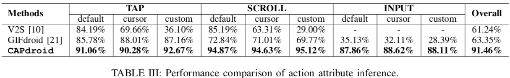 
</div>

CAPdroid outperforms in all actions, e.g., on average 91.33%, 94.87%, 88.19% for *TAP*, *SCROLL*, *INPUT*, respectively.
Our method is on average 30.2% more accurate compared with V2S in action attribute inference due to the advanced approaches of CAPdroid.
Compared with the best baseline (GIFdroid), CAPdroid is on average 28% (91.46% vs 63.35%) more accurate even compared with the best baseline.


## Usefulness Evaluation
<!-- > For more details, experimental setup and results, please check the instructions in [usefulness.md](usefulness.md) -->

We conducted a user study to evaluate the usefulness of our generated descriptions (reproduction steps) for replaying bug recordings in the real-world development environments. 

The study involved two groups of four participants: the control group who gets help with the reproduction steps written by reporters from GitHub, and the experimental group who gets help with the natural language description generated by our tool.

<table width="100%" style="font-size:80%"><tbody>
<th valign="bottom" width="25%">
    <a target="_blank" href="https://github.com/fossasia/neurolab-android/issues/601">NeuroLab-Issue#601</a>
</th>
<th valign="bottom" width="25%">
    <a target="_blank" href="https://github.com/getodk/collect/issues/3222">Collect-Issue#3222</a>
</th>
<th valign="bottom" width="25%">
    <a target="_blank" href="https://github.com/ramack/ActivityDiary/issues/285">ActivityDiary-Issue#285</a>
</th>
<th valign="bottom" width="25%">
    <a target="_blank" href="https://github.com/MarcusWolschon/osmeditor4android/issues/637">Osmeditor-Issue#637</a>
</th>
<tr>
<td align="center">
    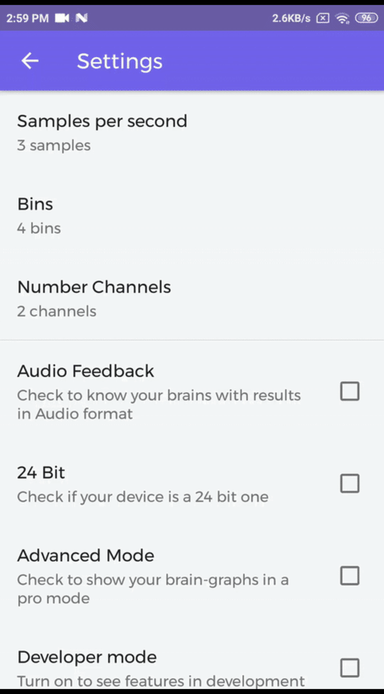
</td>
<td align="center">
    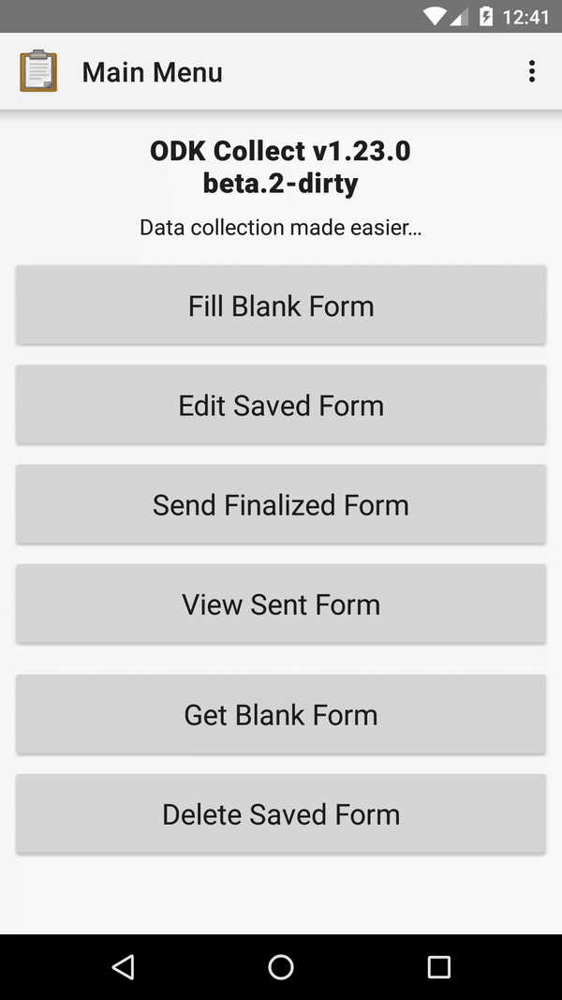
</td>
<td align="center">
    
</td>
<td align="center">
    
</td>
</tr>
</tbody></table>


### Results

<div align="center" float="left">
    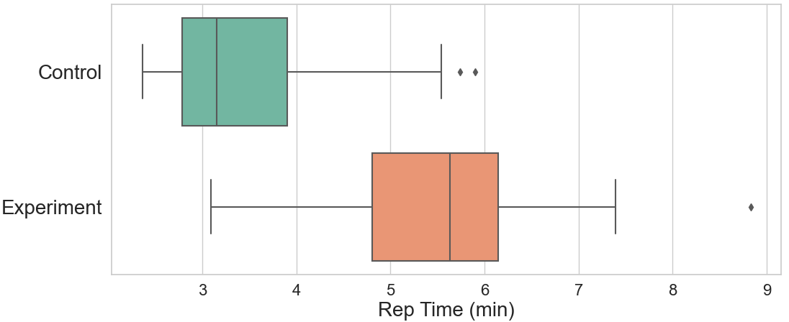 
    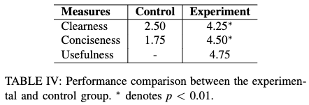 
</div>

Overall, participants appreciate the usefulness of our approach for providing them with clear and concise step descriptions to describe the actions performed on the bug recordings, so that they can easily replay them.
Given our generated reproduction steps, the experimental group reproduces the bug recording much faster than that of the control group (with an average of 3.46min versus 5.53min, saving 59.8% of time).
All participants admit that our approach can provide more easy-to-understand step descriptions for them, in terms of 4.25 vs 2.50 in clearness, and 4.50 vs 1.75 in conciseness, compared with the control group.
And also the participants strongly agree (4.75) the usefulness of our approach.


## Citations
Please consider citing this paper if you use the code:
```
@article{feng2021read,
  title={Read It, Don't Watch It: Captioning Bug Recordings Automatically},
  author={Feng, Sidong and Xie, Mulong and Xue, Yinxing and Chen, Chunyang},
  booktitle={2023 IEEE/ACM 45th International Conference on Software Engineering (ICSE)},
  year={2023},
  organization={IEEE}
}
```