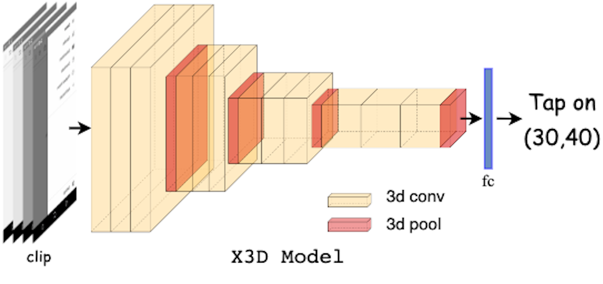
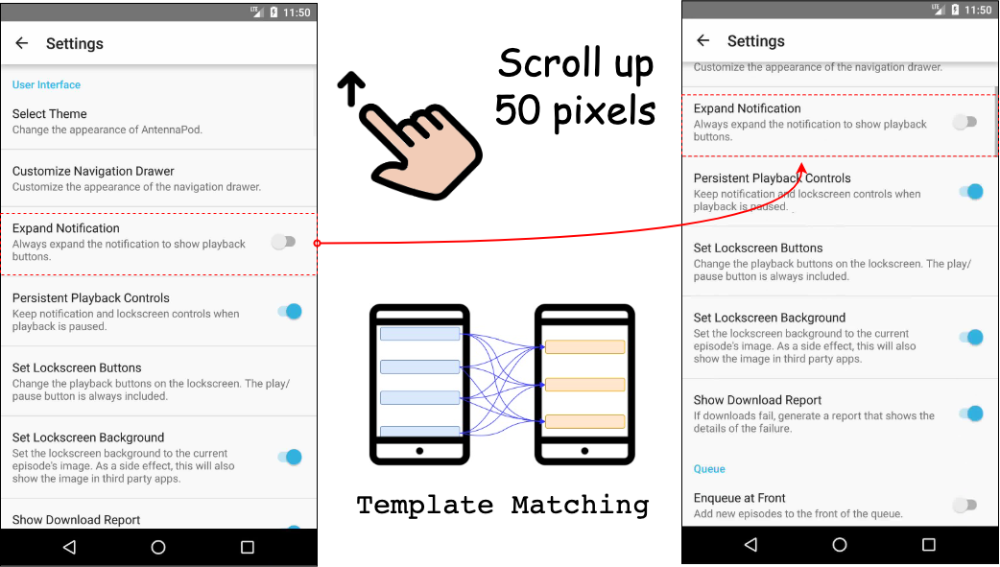
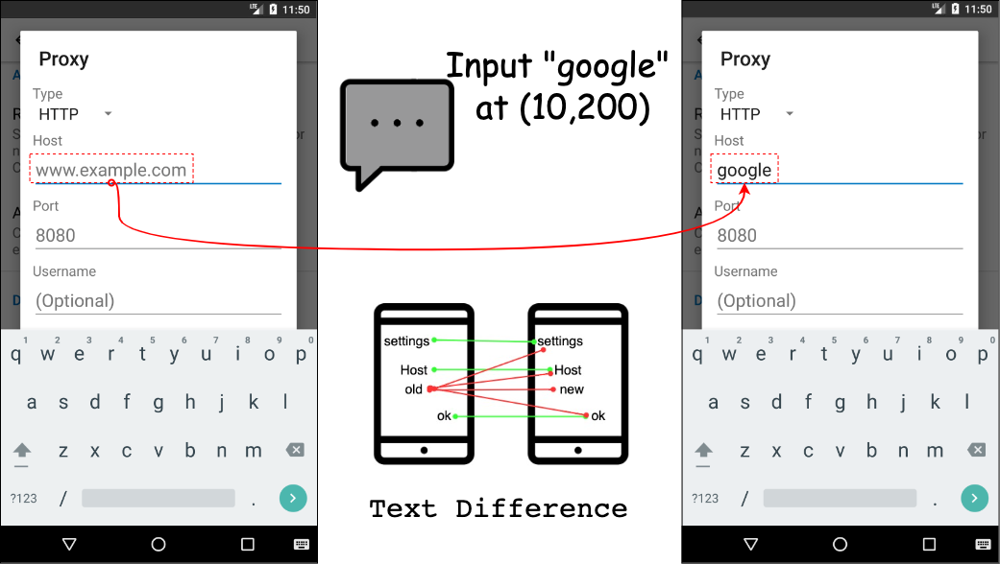
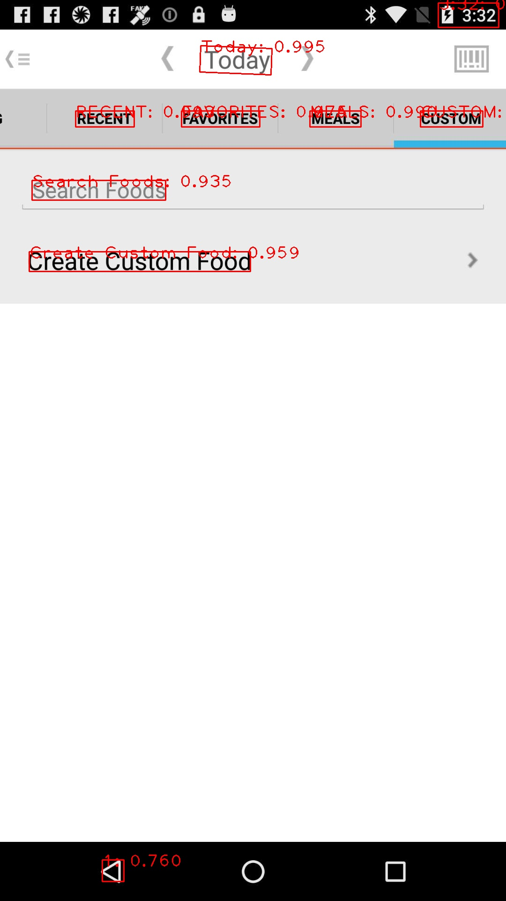
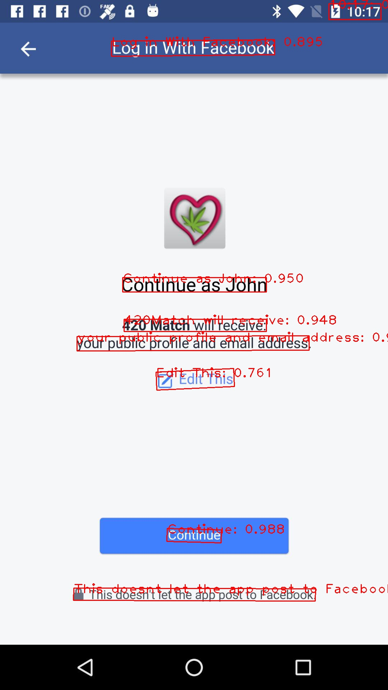
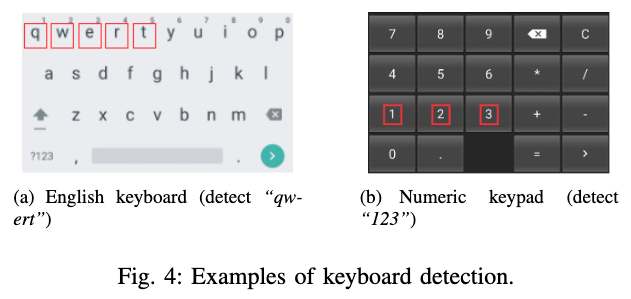
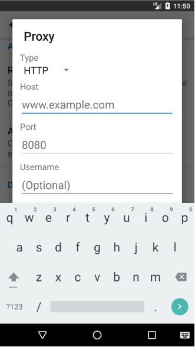
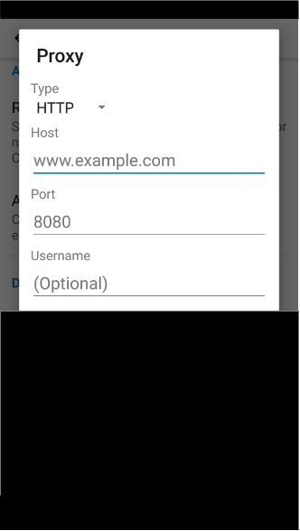

# Phase 2: Action Attribute Inference
Given a recording clip of user action segmented by the previous phase, we then infer its detailed attributes, including touch location of (*TAP*), its moving offset (*SCROLL*), and its input text (*INPUT*), to reveal where the user interacts with on the screen.

## Prerequisite
- pytorchvideo
- pytorch
- torchvision
- moviepy
- skimage
- PaddleOCR
- difflib

## Inferring *TAP* location
<p align="center">
 
</p>

We adopt a Conv3d-based model X3D that simultaneously models spatial features for single-frame GUIs and temporal features for multi-frames optical flow.

### Train X3D model
1. Please follow the instructions of [PyTorchVideo](https://pytorchvideo.org/) to set up the environment.

2. Load pre-trained model to finetune
```
model = torch.hub.load('facebookresearch/pytorchvideo', 'x3d_m', pretrained=True)
model.blocks[5] = pytorchvideo.models.head.create_res_basic_head(in_features=192, out_features=2, pool=nn.AdaptiveAvgPool3d)
```

3. Load and Transform the training dataset
    - resize the video to (466, 830)
    - uniformly sample 16 frames at 5 frame intervals
    - apply mean (0.45, 0.45, 0.45) and standard deviation (0.225, 0.225, 0.225)
```
ffmpeg -i video_path -vf scale=466:830 video_path

video = EncodedVideo.from_path(video_path)
video_frames = video.get_clip(start_sec=0, end_sec=16 * 5 / 30)['video']

'train': transforms.Compose([
        UniformTemporalSubsample(16),
        Lambda(lambda x: x/255.0),
        NormalizeVideo((0.45, 0.45, 0.45), (0.225, 0.225, 0.225)),
    ])
```

4. Set up the training configurations and train the X3D model
```
epoch = 30
batch_size = 4
lr = 0.009
momentum = 0.9
weight_decay = 1e-4
```


## Inferring *SCROLL* offset

<p align="center">
 
</p>

To infer the scrolling direction (i.e., upward, downward) and distance (i.e., amount of movement) from GUI recording clip, we measure the motion trajectory of GUI elements by K-folds template matching method.

### K-folds template matching
1. We first divide the previous GUI into K-folds template vertically.
```
height = im1.shape[0]
piece_height = int(height / K)
im1_pieces = [(y, im1[y:y+piece_height, 0:width]) for y in range(0, height, piece_height)]
```

2. We match the template of each fold in the next frame to compute the scrolling offset between consecutive frames. 
```
from skimage.feature import match_template
offsets = []
for y_piece, im1_piece in im1_pieces:
    result = match_template(im2, im1_piece)
    x_matched, y_matched = np.unravel_index(np.argmax(result), result.shape)[::-1]
    y_offset = y_matched - y_piece
    offsets.append(y_offset)
```

3. At the end, we derive the scrolling distance by summing the offsets.
```
sum_offset = sum(offsets)
```

## Inferring *INPUT* text

<p align="center">
 
</p>

We leverage a practical OCR technique PP-OCRv2 to detect the text difference between the first frame (opening keyboard) and the last frame (closing keyboard).

### OCR technique
1. Set up `PP-OCRv2`.
    - Install PaddleOCR follow [tutorial](https://github.com/PaddlePaddle/PaddleOCR/blob/release/2.5/doc/doc_en/quickstart_en.md)
    ```
    python3 -m pip install paddlepaddle-gpu
    pip install "paddleocr>=2.0.1"
    ```
    - Download the pretrained weights
        - detection model [weights](https://paddleocr.bj.bcebos.com/PP-OCRv3/english/en_PP-OCRv3_det_infer.tar)
        - classifer model [weights](https://paddleocr.bj.bcebos.com/dygraph_v2.0/ch/ch_ppocr_mobile_v2.0_cls_infer.tar)
        - recognition model [weights](https://paddleocr.bj.bcebos.com/PP-OCRv3/english/en_PP-OCRv3_rec_infer.tar)
    ```
    ocr = PaddleOCR(use_angle_cls=False, lang='en',
                            det_model_dir=DET_WEIGHT,
                            rec_model_dir=REC_WEIGHT,
                            cls_model_dir=CLS_WEIGHT)
    ```
    - Some inferred text samples
    <table width="100%"><tbody>
    <tr>
    <td align="center" width="33%"></td>
    <td align="center" width="33%"></td>
    <td align="center" width="33%"></td>
    </tr>
    </tbody></table>

2. (**Optional**) We find that mask the keyboard can achieve better performance
    - Detect the keyboard type (i.e., English keyboard, Numeric keypad) using hueristic pattern
    <p align="center">
     
    </p>

    - Mask the area
    <table width="100%"><tbody>
    <th valign="bottom" align="center" width="25%">English keyboard</th>
    <th valign="bottom" align="center" width="25%">Masked keyboard</th>
    <th valign="bottom" align="center" width="25%">Numeric keypad</th>
    <th valign="bottom" align="center" width="25%">Masked keypad</th>
    <tr>
    <td align="center" width="25%"></td>
    <td align="center" width="25%"></td>
    <td align="center" width="25%"></td>
    <td align="center" width="25%"></td>
    </tr>
    </tbody></table>

3. We next compare the texts accordingly by string matching algorithm SequenceMatcher, that is detecting the longest contiguous matching subsequence.
```
from difflib import SequenceMatcher
# initialize a text similarity matrix for two frames
_matrix = np.zeros((len(last_frame_texts), len(first_frame_texts)))
for i in range(len(last_frame_texts)):
    for j in range(len(first_frame_texts)):
        last_text = last_frame_texts[i].lower()
        first_text = first_frame_texts[j].lower()
        _matrix[i][j] = SequenceMatcher(None, last_text, first_text).ratio()
# Select the most unmatched text between two frames, representing input text 
input_idx = np.argmin(np.amax(_matrix, axis = 1))
input_text = last_frame_texts[input_idx]
```