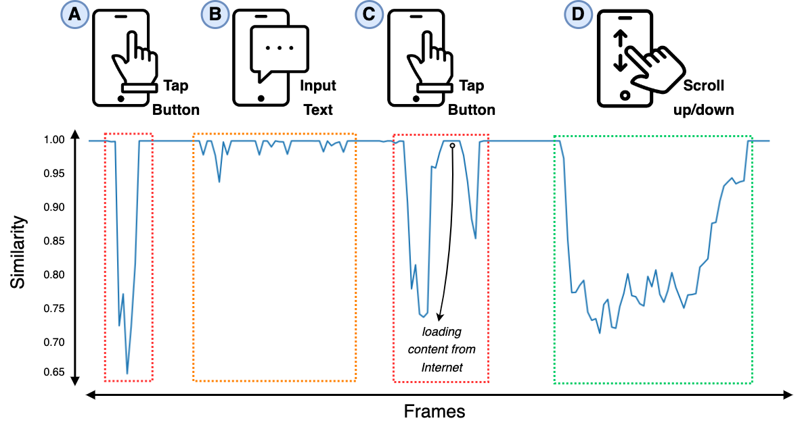

# Phase 1: Action Segmentation

 

Figure: An illustration of consecutive frame similarity.

A video consists of a sequence of frames to deliver the visual detail of the story for particular scenes.
Different from the recognition of discontinuities in the visual-content flow of natural-scene videos, detecting clips in the GUI recording is to infer scenes of user actions that generally display significant changes in the GUIs.
To that end, we leverage the similarity of consecutive frames to segment user actions (i.e., *TAP*, *SCROLL*, *INPUT*) from GUI recording.

## Prerequisite
- opencv-contrib-python==3.4.2.16
- opencv-python==4.5.1.48
- matplotlib==3.3.4
- numpy==1.19.2
- scikit-image==0.17.2
- scikit-learn==0.24.2

## Setup Instructions
1. Calculate the Y-Diff similarity of consecutive frames following previous work of GIFdroid[^1]. Please set up the environment according to their [instructions](https://github.com/sidongfeng/gifdroid).

2. We further obersve the patterns of user actions in the frame sequence, and find that:
    - *TAP*: the similarity score starts to drop drastically which reveals an instantaneous transition from one screen to another.
    - *SCROLL*: the similarity score starts with a drastic drop and then continues to increase slightly over a period of time, which implicates a continuous transition from one GUI to another.
    - *INPUT*: the similarity score starts to drop and rise multiple times, revealing typing characters and digits. However, the similarity score cannot reliably detect *INPUT* actions, as it may coincide with the *TAP* actions. To address this, we further supplement with [Optical Character Recognition (OCR)](https://github.com/PaddlePaddle/PaddleOCR) technique (A detailed instruction to OCR is in [here](action_attribute_inference.md#inferring-input-text)) to detect whether there is a virtual keyboard in the GUI. 

 

[^1]: Feng, Sidong, and Chunyang Chen. "GIFdroid: automated replay of visual bug reports for Android apps." 2022 IEEE/ACM 44th International Conference on Software Engineering (ICSE). IEEE, 2022.