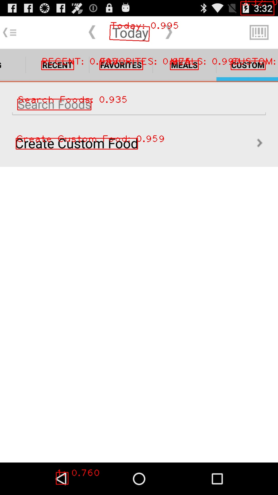
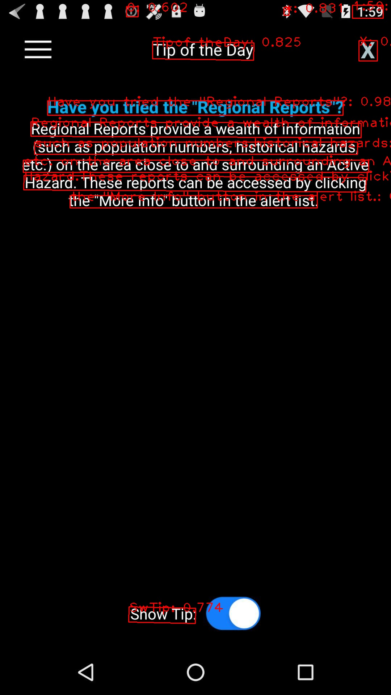
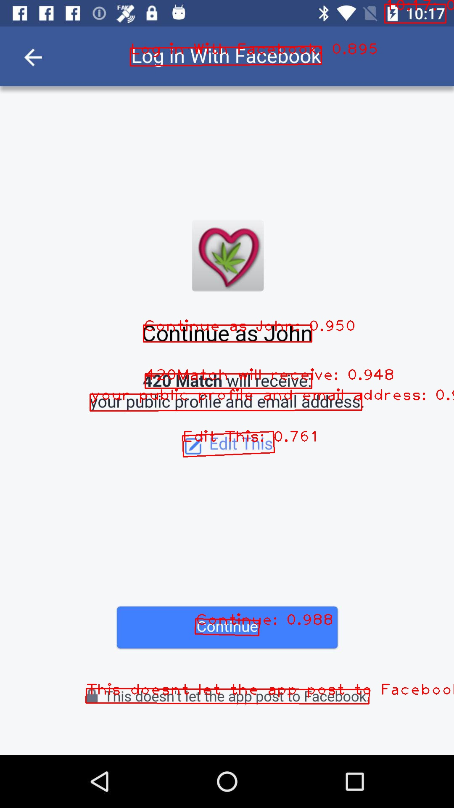
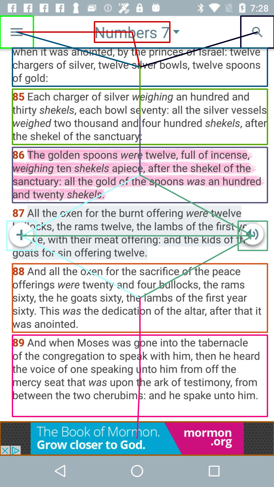
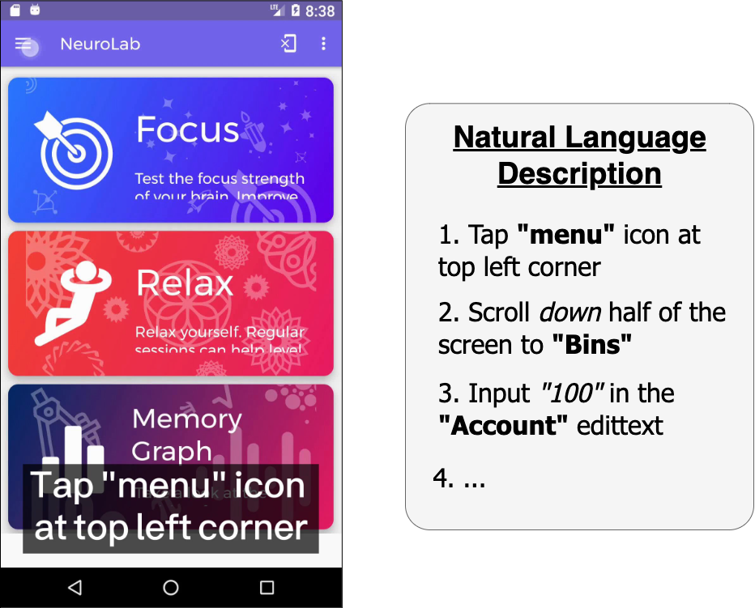

# Phase 3: Description Generation
Once the attributes of the action are derived from the previous phases, we proceed by generating in-depth and easy-to-understand natural language descriptions. To accomplish this, we first leverage mature GUI understanding models to obtain GUI information non-intrusively.
Then, we propose a novel algorithm to phrase actions into descriptions and embed them as subtitles.

## Prerequisite
- detectron2
- PaddleOCR
- pytorch
- Wand

## GUI Understanding
We adopt 5 mature methods to obtain information from GUI non-intrusively.
<div align="center">
     
</div>

### GUI Element Detection
We implement the state-of-the-art object detection model Faster-RCNN with ResNet-101 and Feature Pyramid Networks to detect 11 GUI element classes on the screen.
1. Set up `Detectron2` environment.
```
git clone https://github.com/facebookresearch/detectron2.git
python -m pip install -e detectron2
cd detectron2
```
2. Create dataset from Rico following their [instructions](https://detectron2.readthedocs.io/en/latest/tutorials/datasets.html)

3. (**Optional**) Create soft link for the Rico dataset
```
cd dataset
ln -s {RICO_DATA} coco
```

4. Prepare a train script (`tools/train_rico_object_detection.py`) following `tools/train_net.py`
    - Declare GUI element classes
    - Register dataset
```
CLASS_NAMES = ['button', 'checkbox', 'edittext', ...]
DATASET_ROOT = './datasets/coco'

DatasetCatalog.register("coco_object_train", lambda: load_coco_json(TRAIN_JSON, TRAIN_PATH))
MetadataCatalog.get("coco_object_train").set(thing_classes=CLASS_NAMES,
                                                evaluator_type='coco',
                                                json_file=TRAIN_JSON,
                                                image_root=TRAIN_PATH)

cfg.MODEL.ROI_HEADS.NUM_CLASSES = 11
```

5. Train the model
```
python tools/train_rico_object_detection.py \
                        --config-file ./configs/COCO-Detection/faster_rcnn_R_101_FPN_3x.yaml \
                        --num-gpus 1 \
                        SOLVER.IMS_PER_BATCH 16 \
                        SOLVER.BASE_LR 0.0025 \
                        SOLVER.MAX_ITER 370000 \
                        TEST.EVAL_PERIOD 10001 
```

6. (**Optional**) Evaluate the model
```
python tools/train_rico_object_detection.py \
                        --config-file ./configs/COCO-Detection/faster_rcnn_R_101_FPN_3x.yaml \
                        --eval-only MODEL.WEIGHTS {PRETRAINED_MODEL}
```

7. Some inferred samples from Rico

<table width="100%"><tbody>
<tr><td align="center"></td>
<td align="center"></td>
<td align="center"></td>
<td align="center"></td>
</tr>
</tbody></table>

### Text Extraction
For each GUI element, we adopt the OCR technique to detect the text (if any). The detailed of instructions is described in [here](action_attribute_inference.md#inferring-input-text).

1. Some inferred samples from Rico

<table width="100%"><tbody>
<tr><td align="center" width="25%"></td>
<td align="center" width="25%"></td>
<td align="center" width="25%"></td>
<td align="center" width="25%"></td>
</tr>
</tbody></table>


### Icon Annotation
We adopt a transformer-based model LabelDroid to caption the icon image.
1. Set up `LabelDroid` environment.
```
git clone https://github.com/chenjshnn/LabelDroid
cd LabelDroid/LabelDroid
pip install -r requirement.txt
```

2. Download the resources
    - dataset: [resource](https://www.dropbox.com/sh/7jwtjhuqh2rit6x/AACriiIAxdEY-WdiJCpt2NTPa?dl=0)
    - vocabulary: [vocab.pkl](https://www.dropbox.com/sh/7jwtjhuqh2rit6x/AACriiIAxdEY-WdiJCpt2NTPa?dl=0)

3. Train the model (`train_transformer.sh`)
```
python train.py \
            --image_root <PATH_TO_YOUR_DATASET_FOLDER> \
            --caption_path <PATH_TO_ANNOTATION_FOLDER> \
            --vocab_path <PATH_TO_GENERATED_VOCAB_FILE> \
            --caption_model transformer \
            --model_path run/models \
            --num_epochs <NUM_EPOCH> \
            --batch_size <BATCH_SIZE> 
```

4. Evaluate the model (`test_transformer.sh`)
```
python3 test.py \
        --image_root <PATH_TO_YOUR_DATASET_FOLDER> \
        --caption_path <PATH_TO_ANNOTATION_FOLDER> \
        --vocab_path <PATH_TO_GENERATED_VOCAB_FILE> \
        --caption_model transformer \
        --model_path <PATH_TO_TRAINED_MODEL_DIR> \
        --batch_size <BATCH_SIZE> \
        --split test \
```

5. Some inferred samples
<table width="100%"><tbody>
<th valign="bottom" width="16%">Backward</th>
<th valign="bottom" width="16%">More options</th>
<th valign="bottom" width="16%">Menu</th>
<th valign="bottom" width="16%">Take photos</th>
<th valign="bottom" width="16%">Share info</th>
<th valign="bottom" width="16%">Zoom in</th>
<tr>
<td align="center"></td>
<td align="center"></td>
<td align="center"></td>
<td align="center"></td>
<td align="center"></td>
<td align="center"></td>
</tr>
</tbody></table>

### Absolute Positioning
We uniformly segment the GUI into 3 * 3 grids, delineating horizontal position (i.e, left, right), vertical position (i.e, top, bottom), and center position.

```
# bbox: The bounding box of the GUI element.
bbox_center_x = (bbox[0] + bbox[2]) / 2
bbox_center_y = (bbox[1] + bbox[3]) / 2
bbox_grid_x = _grid_coordinate(bbox_center_x, screen_width)
bbox_grid_y = _grid_coordinate(bbox_center_y, screen_height)
return bbox_grid_y * 3 + bbox_grid_x
```

<div align="left">
 
</div>


### GUI Element Relationship
We aim to transform the "flat" structure of GUI elements into connected relationships by computing the horizontal and vertical distance.

1. We first initialize a horizontal and vertical matrix. 
```
# elements: List of GUI elements
vertical_adjacency = np.zeros((len(elements), len(elements)))
horizontal_adjacency = np.zeros((len(elements), len(elements)))
```

2. Calculate the distance between each element by euclidean pixel measurement.
```
for row in range(len(elements)):
    for column in range(len(elements)):
        if row == column:
            h_dist = v_dist = 0
        else:
            element1 = elements[row]
            element2 = elements[column]
            h_dist, v_dist = element1.pixel_distance(element2)
        vertical_adjacency[row][column] = v_dist
        horizontal_adjacency[row][column] = h_dist
```

3. Some inferred samples from Rico

<table width="100%"><tbody>
<th valign="bottom" width="25%">46337</th>
<th valign="bottom" width="25%">42495</th>
<th valign="bottom" width="25%">47669</th>
<th valign="bottom" width="25%">15452</th>
<tr>
<td align="center"></td>
<td align="center"></td>
<td align="center"></td>
<td align="center"></td>
</tr>
</tbody></table>
    

## Subtitle Creation
The main instruction of interest is to create a clear and concise subtitle description based on  {**action**, **object**}.
The global GUI information is further used to complement the description by {**position**, **relationship**}.

<div align="center">
     
</div>

1. Here are some generated descriptions

<table width="100%"><tbody>
<th valign="bottom" width="33%">Tap 'ADD' button</th>
<th valign="bottom" width="33%">Tap 'HelloWorld' edittext</th>
<th valign="bottom" width="33%">Tap 'more options' icon at top right corner</th>
<tr><td align="center"></td>
<td align="center"></td>
<td align="center"></td>
</tr>
</tbody></table>

<table width="100%"><tbody>
<th valign="bottom" width="33%">Scroll down half of the screen to 'Display advanced settings'</th>
<th valign="bottom" width="33%">Scroll down three quarters of the screen to 'Anthony Tran'</th>
<tr><td align="center"></td>
<td align="center"></td>
</tr>
</tbody></table>

<table width="100%"><tbody>
<th valign="bottom" width="33%">Input 'Test' in the 'Description' edittext</th>
<th valign="bottom" width="33%">Input '100' in the 'Amount' edittext</th>
<tr><td align="center"></td>
<td align="center"></td>
</tr>
</tbody></table>

2. To embed the description in GUI image
```
from wand.image import Image
from wand.drawing import Drawing
from wand.font import Font

with Image(width=img.shape[1], height=img.shape[0]) as canvas:
    with Drawing() as background:
        background.fill_color = 'black'
        background.rectangle(left, top, width, height)
        font = Font(font_path)
        background(canvas)
        canvas.caption('Tap "ADD" button', desc_left, desc_top, desc_width, desc_height, font, gravity='center')
```

<p align="center">
 
</p>

## Troubleshooting
1. Cannot load pickle file in **Icon Annotation**
    - Solution: Update it to HIGHEST_PROTOCOL
    ```
    import pickle
    with open(config.CAPTION_VOCAB_FILE, 'rb') as f:
        vocab = pickle.load(f)
    
    with open('filename.pickle', 'wb') as handle:
        pickle.dump(vocab, handle, protocol=pickle.HIGHEST_PROTOCOL)
    ```