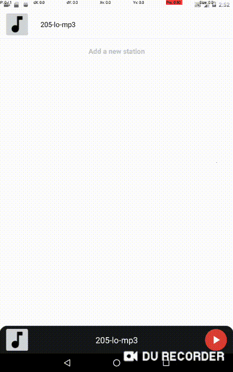

# Preliminary Study
To understand the recordings from the end-users, we conducted a small pilot study of the GUI recordings from GitHub.

## Prerequisite
- scrapy==2.6.2
- GitHub REST API

## Crawling GUI Recordings
1. We first use web crawler Scrapy to download all the Android apps from F-Droid[^1]. Overall, we obtain 1,274 apps.

2. We automatically crawl the bug reports from GitHub issue repositories that contain GUI recordings with suffix names like .gif, .mp4, etc.
    - Please follow the instructions to set up [GitHub REST API](https://docs.github.com/en/rest)
```
curl -i -H Authorization https://api.github.com/repos/rails/rails/issues
```

3. We obtain the recordings from 2021, that consists 5,231 GUI recordings.

4. We randomly sample 1,000 (11.5%) GUI recordings, and we recruit two annotators from online to manually check the user actions from the recordings.

## Results
We observe that 89% of the recordings included a touch indicator, indicating it as a mechanism for the end-user to depict their actions on the screen.
We further classify those touch indicators into three categories, following Card Sorting method:

<p align="center">
 
</p>

* **default (68%).** renders a small semi-transparent circle, that gives a visual feedback when the user presses his finger on the device screen. This is the default touch indicator on Android.

* **cursor (27%).** users/developers may test the apps in the emulator and directly record the desktop, so that the user actions are captured by the desktop cursor.

* **custom (5%).** the touch indicator is customized by third-party screen recorders, such as DU Recorder, etc.

<table width="100%"><tbody>
    <th valign="bottom" align="center" width="33%">Default</th>
    <th valign="bottom" align="center" width="33%">Cursor</th>
    <th valign="bottom" align="center" width="33%">Custom</th>
    <tr><td align="center"></td>
    <td align="center"></td>
    <td align="center"></td>
    </tr>
</tbody></table>

[^1]: F-Droid: https://f-droid.org/en/packages/.